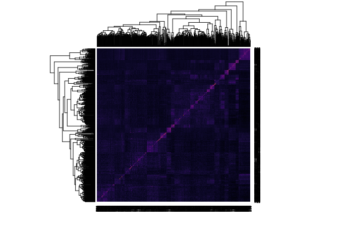
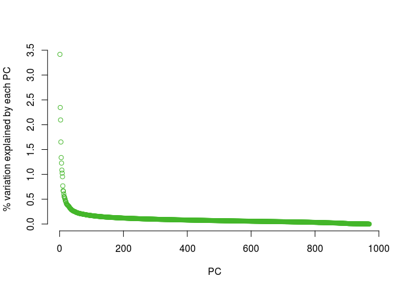
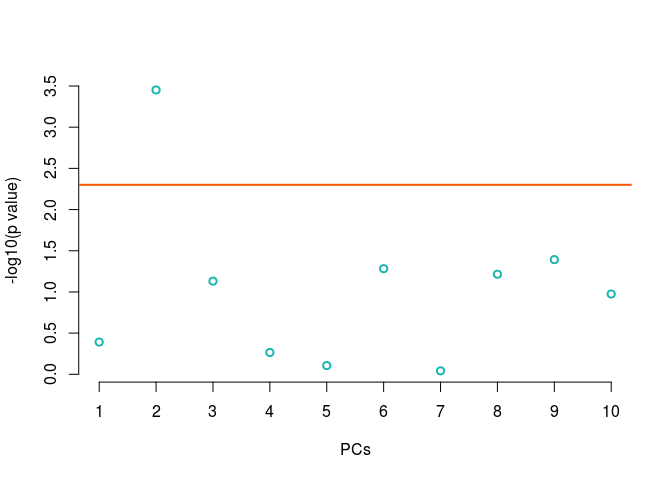
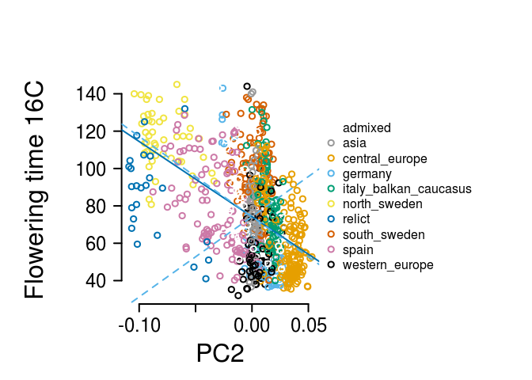
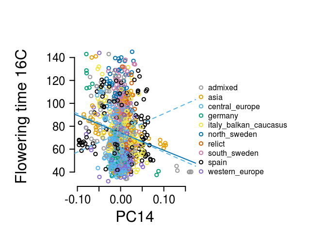

```r
knitr::opts_chunk$set(echo = TRUE)
library(dplyr)
```

```
## 
## Attaching package: 'dplyr'
```

```
## The following objects are masked from 'package:stats':
## 
##     filter, lag
```

```
## The following objects are masked from 'package:base':
## 
##     intersect, setdiff, setequal, union
```

```r
library(viridis)
```

```
## Loading required package: viridisLite
```

```r
library(quaint)
```

Here is some example code for running Qpc using Arabidopsis flowering time data.


## 1. Load in the data

```r
##read in the data. I have it stored as one combined file with traits and genotypes and other info for all the individuals in my dataset.
#load('data/genos-traits-arabidopsis.rda')
load('data/1001-matrix-50Ksamp.rda')
#load('data/ft16_qpc_inputs.rda')
allData = read.csv('data/1001genomes-FT10-FT16 and 1001genomes-accessions.csv', stringsAsFactors = F)
#get rid of missing data
allDataFT16 = dplyr::filter(allData, is.na(FT16_mean) == FALSE)


#pull out genotype data for individuals with phenotypes
combinedData = dplyr::inner_join(allDataFT16, myGt, by='id')
myG = combinedData[,-c(1:17)]
myTraits = combinedData[,1:17]
```


## 2. Make a kinship matrix. 
The input for this is a table of genotypes. You want to randomly sample loci -- I usually use 50,000 SNPs but you may want to use more or less for various reasons. It's a good idea to comapre matrices for a couple different samples to make sure that sampling variance isn't causing a problem. You also want to have no missing data here -- I use a random imputation to replace missing data types. 

```r
## Make the k matrix using the make_k function.
myK = make_k(as.matrix(myG))

## we can look at myK a bit to see how we feel about it.
#heatmap(myK, col=inferno(100))

#doing the eigen decomposition
myEig = eigen(myK)

plot(myEig$vectors[,1], myEig$vectors[,2], bty="n", xlab = "PC1", ylab = "PC2", col = '#FF5300')
```

<!-- -->

```r
plot(myEig$values/sum(myEig$values)*100, col = "#43B629", bty="n", ylab = "% variation explained by each PC", xlab = "PC")
```

<!-- -->

## 3. Run Qpc. 
In the function:
* myZ is a vector of trait values
* myU is the eigen vectors of the kinship matrix
* myLambdas is the eigen values of th ekinship matrix
* myL is the range of PCs used to estimate Va
* myM is the range of PCs used to test for selection

```r
myQpc = calcQpc(myZ = myTraits$FT16_mean, 
                   myU = myEig$vectors, 
                   myLambdas = myEig$values,
                   myM = 1:10,
                    myL = 485:969)
```

## 4. Look at the Qpc output.


myQpc$pvals is a list of pvalues for each test.


```r
plot(-log10(myQpc$pvals), bty="n", xlab = "PCs", ylab = "-log10(p value)", col = "#1BB6AF", lwd=2, xaxt="n")
abline(h = -log10(0.05/length(myQpc$pvals)), col = "#FF5300", lwd=2)
axis(1, at = c(1:length(myQpc$pvals)))
```

<!-- -->

Now look at specific PCs. I'm going to color plots by subpopulation but you could do something else. Keep in mind that the confidence intervals are just for plotting because they're based on a linear model for how PCs relate to traits, but the actual test is not linear. 

```r
#estimate the confidence intervals
myVaest = var0(myQpc$cml)
myCI = 1.96*sqrt(myVaest*myEig$values)

#plot
palette(c('white','#999999', '#E69F00', '#56B4E9', "#009E73", "#F0E442", "#0072B2", "#D55E00", "#CC79A7", 'black', 'mediumpurple3'))
par(mar = c(5,8,5,14), xpd=T)

plot(myEig$vectors[,2], myTraits$FT16_mean[-nrow(myTraits)], bty="n", col = as.factor(myTraits$group), lwd=2, ylab = "", yaxt="n",xlab = "PC2", cex.lab=2, cex.axis=2, xaxt="n")
axis(1, cex.axis=1.5, lwd=2)
axis(2, las=2, cex.axis=1.5, lwd=2)
mtext('Flowering time 16C',side=2, line=5, cex=2)
legend(0.06, 130, levels(as.factor(myTraits$group)), pch=1, pt.lwd = 2,col = palette(), bty="n", text.width = 0.04)
par(xpd=F)
abline(lm(myTraits$FT16_mean[-nrow(myTraits)]~myEig$vectors[,2]), lwd=2, col = "#0072B2")
abline(a=mean(myTraits$FT16_mean), b = myCI[2], lty=2, col='#56B4E9', lwd=2)
abline(a=mean(myTraits$FT16_mean), b = -myCI[2], lty=2, col='#56B4E9', lwd=2)
```

<!-- -->

```r
par(mar = c(5,8,5,14), xpd=T)
plot(myEig$vectors[,1], myTraits$FT16_mean[-nrow(myTraits)], bty="n", col = as.factor(myTraits$group), lwd=2, ylab = "", yaxt="n",xlab = "PC1", cex.lab=2, cex.axis=2, xaxt="n")
axis(1, cex.axis=1.5, lwd=2)
axis(2, las=2, cex.axis=1.5, lwd=2)
mtext('Flowering time 16C',side=2, line=5, cex=2)
legend(0.12, 130, levels(as.factor(myTraits$group)), pch=1, pt.lwd = 2,col = palette(), bty="n", text.width = 0.04)
par(xpd=F)
abline(lm(myTraits$FT16_mean[-nrow(myTraits)]~myEig$vectors[,1]), lwd=2, col = "#0072B2")
abline(a=mean(myTraits$FT16_mean), b = myCI[1], lty=2, col='#56B4E9', lwd=2)
abline(a=mean(myTraits$FT16_mean), b = -myCI[1], lty=2, col='#56B4E9', lwd=2)
```

<!-- -->


